# 📚 Trilha Inicial Ciência de Dados Jr


## Projeto de Análise de Dados de Cursos

- Este projeto tem como objetivo analisar os dados de vendas de cursos e prever analisar a receita total gerada pela venda dos cursos ,Identificar o curso com o maior número de vendas, Visualizar a distribuição das vendas ao longo do tempo através de gráficos.    Utilizamos diversas técnicas de análise de dados e visualização para obter os insights.

----

#### Análise de Dados: Vendas de Cursos Online
 ###***Titulos das Colunas*** 
 
- **ID:** Identificador único de cada curso vendido.
- **Nome do Curso:** Nome do curso vendido na plataforma.
- **Quantidade de Vendas:** Número de vendas realizadas para cada curso.
- **Preço Unitário:** Preço unitário do curso.
- **Data:** Data da venda do curso.

----


### **Configuração do Ambiente:**
- Python 3.10 ou outras versões 
- Jupyter Notebook
- Pandas
- Matplotlib
- Scikit-learn
- pip install -r requirements.txt 

----

### Explicação do Código 

- Carregamento dos Dados 

O Arquivo encontra-se na pasta CSV com o nome curso ``` cursos_online.CSV´´´´

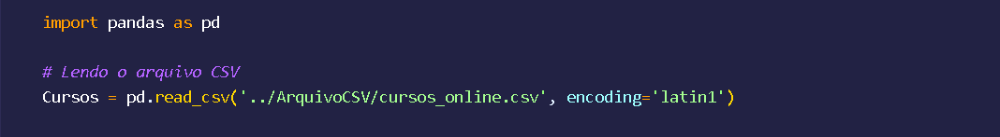


### Analise Exploratória 

Neste processo estamos Avaliando a Relação dos Curso com sua quantidade de Venda 

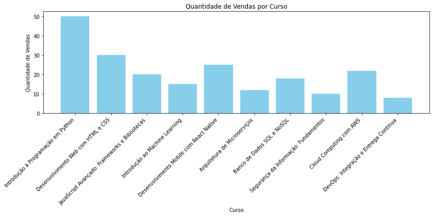

----

Já Aqui estamos Avaliando os Curso pelo seu preço unitário 

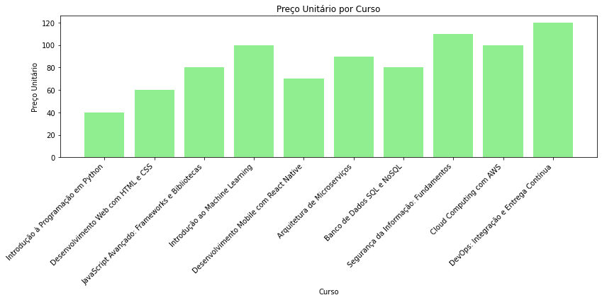

----

Nesta Exploração estamos trazendo *Histograma para Quantidade de Vendas* ,que nos ajuda a entender como as vendas estão distribuidas entre os cursos. os picos indicam  que um número de vendas é mais comum entre os cursos. assim conseguimos entender 
as frequencias de vendas 

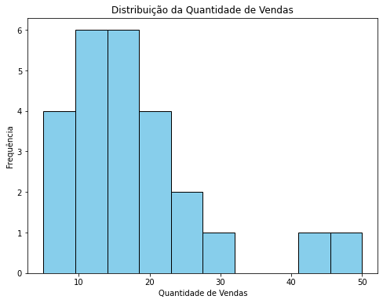


----

Neste histograma podemos entender como os preços dos cursos estão distribuídos , quantos cursos têm um determinado preço. os picos, indica que o preço específico é mais comum entre os cursos. Pode-se identificar se há muitos cursos com preços altos, médios ou baixos. 

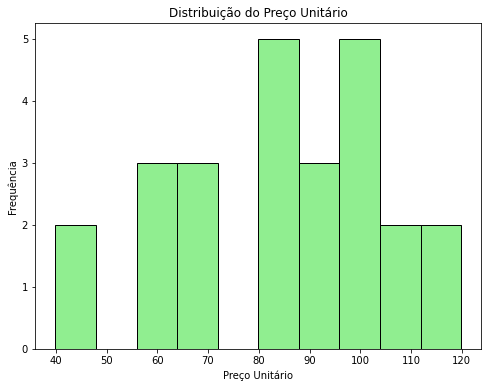


----


###  Receita Total 

Para identificarmos o valor da receita  Cursos['Receita'] = Cursos['Quantidade de Vendas'] * Cursos['Preço Unitário']
dessa forma conseguimos saber o valor da receita total e ainda assim criamos o valor da receita de cada curso 


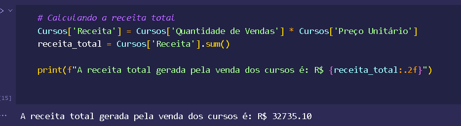


----

### Receit de Cada Curso 

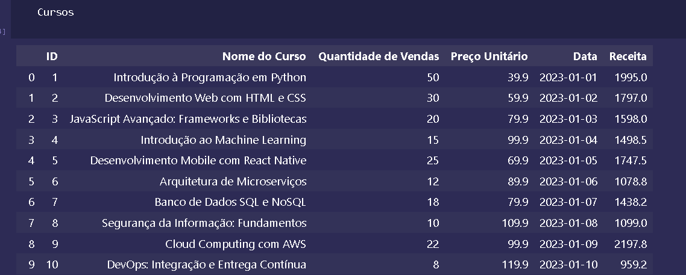


----

### Curso Mais vendido 

Cursos['Quantidade de Vendas'].idxmax() encontra o índice do curso que tem a maior quantidade de vendas.

Cursos.loc[...] usa o índice retornado pelo idxmax() para localizar a linha inteira correspondente ao curso mais vendido no DataFrame Cursos.

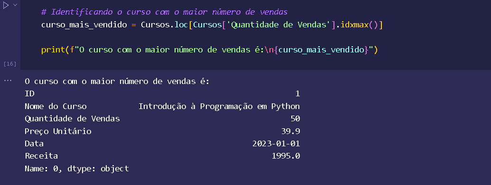


----

### Distribuicao de Vendas ao longo do Tempo 

Conversão da Coluna 'Data' para Tipo Datetime:

Cursos['Data'] = pd.to_datetime(Cursos['Data']) converte a coluna 'Data' do DataFrame Cursos para o tipo datetime. Isso é necessário para garantir que os dados de data sejam interpretados corretamente como datas e não como strings.
Ordenação dos Dados pela Data:

Cursos = Cursos.sort_values(by='Data') ordena o DataFrame Cursos em ordem crescente com base na coluna 'Data'. Isso organiza os dados cronologicamente, o que é essencial para análises temporais.


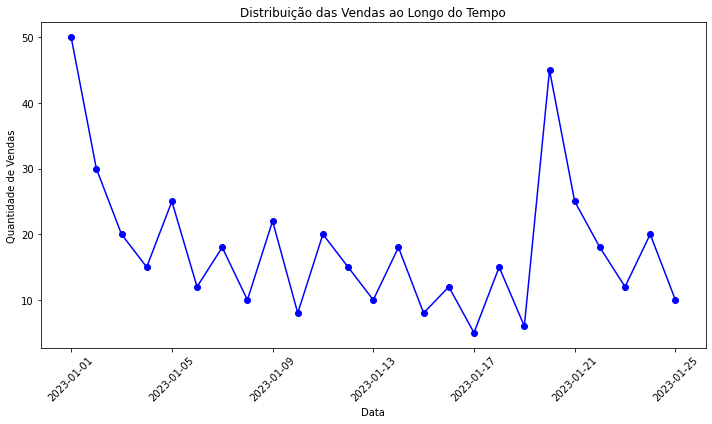

----

### Receita ao Longo do tempo por Curso 

- Neste ponto estamos trazendo a Analise do tempo com relação da receita de cada curso e podemos observar como ela 
- tem variações de acordo com o preço do curso e sua quantidade de vendas e podemos observar que em alguns casos por mais que temos 
- cursos com valores mais baixo e com uma boa quantidade de venda , mas não necessariamente gera mais receita. 
  

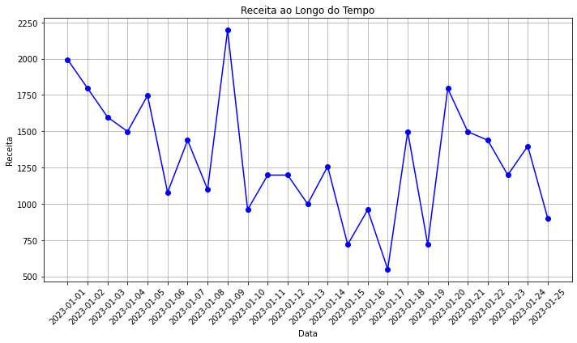

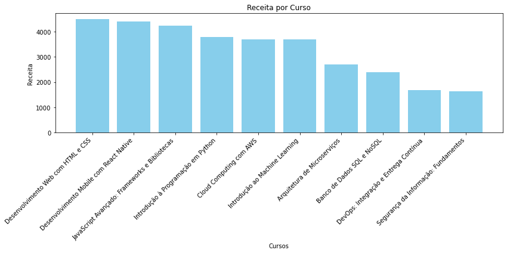

----

### Correlação entre as variaveis 

- **resultados das correlações** 
  
Preço vs Vendas: Cursos mais caros tendem a vender menos unidades.
Vendas vs Receita: Mais vendas geralmente significam mais receita.
Preço vs Receita: Cursos mais caros podem gerar menos receita se as vendas forem muito baixas.

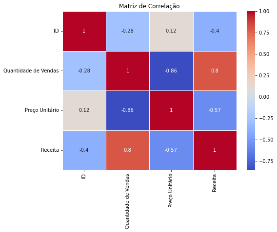

----


### *** Conclusão ***

Dessa forma podemos trazer os seguintes insigths 
Distribuição das Vendas e Preços:

A distribuição da quantidade de vendas mostra que a maioria dos cursos vende entre 10 e 30 unidades.
O preço unitário dos cursos varia principalmente entre 40 e 120 unidades monetárias.

Tendências Temporais:

Ao longo do tempo, observamos flutuações nas vendas, com alguns períodos mostrando picos e outros mais estáveis.

Receita Gerada:

A receita total gerada por cada curso revelou variações significativas, destacando cursos com maior volume de vendas e preços unitários mais elevados como principais geradores de receita.

Correlações:

Identificamos uma forte correlação negativa entre o preço unitário e a quantidade de vendas, indicando que cursos mais caros tendem a vender menos unidades.

Por outro lado, há uma correlação positiva forte entre a quantidade de vendas e a receita gerada, o que sugere que cursos mais vendidos contribuem mais para a receita total.


----
Nome: Marcelo Ishida Takeya 
Linkeind: https://www.linkedin.com/in/marcelo-ishida-takeya-a8213897/

